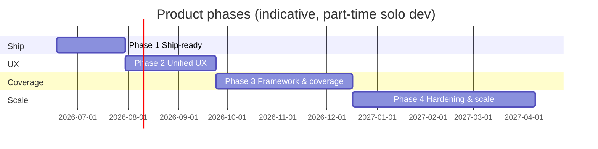

# Product roadmap — post-beta (v1.1+)

**Status:** Active planning  
**Last updated:** 2026-06-18  
**Baseline release:** `1.0.0-beta.1` (M0–M8 complete, sideload-only)

This document schedules work **after** the M8 public beta. Milestone history remains in [ROADMAP.md](ROADMAP.md).

---

## Vision (unchanged)

Local-first protection for freelancers and B2B professionals: **warn before trust** (Phase 1 extension) and **contain after download** (Phase 2 companion). No telemetry, plain language, Windows-first.

**North-star UX:** A new user installs once, sees proof the shield works in under five minutes, and can configure everything from one familiar place.

---

## Phases overview

| Phase | Name | Duration (indicative) | Primary outcome |
|-------|------|----------------------|-----------------|
| **1** | Ship-ready | 4–6 weeks | Store listings + signed installer + clean first-run |
| **2** | Unified UX foundation | 6–8 weeks | `packages/ui`, dashboard Settings, responsive surfaces |
| **3** | Framework & coverage | 8–12 weeks | Platform adapters, B2B/messaging gaps, rule packs |
| **4** | Hardening & scale | Ongoing | Native Messaging, macOS, job profile, E2E, metrics |

**Execution guide:** [phases/PHASE_1_SHIP.md](phases/PHASE_1_SHIP.md) (Phase 1 checklist — start here).

---

## Phase 1 — Ship-ready

**Goal:** Real users install without developer mode.

### Deliverables

| # | Deliverable | Doc / path |
|---|-------------|------------|
| 1.1 | Chrome Web Store listing live | [store/CHROME_WEB_STORE.md](store/CHROME_WEB_STORE.md) |
| 1.2 | Edge Add-ons listing live | [store/EDGE_ADDONS.md](store/EDGE_ADDONS.md) |
| 1.3 | Hosted privacy policy URL | [store/PRIVACY_HOSTING.md](store/PRIVACY_HOSTING.md) |
| 1.4 | Authenticode-signed NSIS installer | [phases/PHASE_1_SHIP.md](phases/PHASE_1_SHIP.md) § Signing |
| 1.5 | Extension zip packaging script | `pnpm package:extension` |
| 1.6 | Post-install funnel (companion → extension → practice → dashboard proof) | Onboarding + companion first launch |
| 1.7 | Dogfood / FP tracking | [dogfood/TRACKER.md](dogfood/TRACKER.md) |
| 1.8 | Fresh Win11 VM sign-off | [phases/PHASE_1_SHIP.md](phases/PHASE_1_SHIP.md) § VM acceptance |
| 1.9 | Release CI workflow | `.github/workflows/release.yml` |

### Exit criteria

- [ ] Clean install on fresh Windows 11 VM without reading source docs
- [ ] Extension installable from Chrome Web Store and Edge Add-ons
- [ ] Companion installer passes SmartScreen (signed)
- [ ] Practice scan → dashboard activity row without manual IPC debugging
- [ ] Dogfood set ≥10 threads logged; FP rate baseline documented

### Out of scope (defer to Phase 2+)

- `packages/ui` design system
- Platform adapter refactor
- Fiverr content script
- Companion autostart

---

## Phase 2 — Unified UX foundation

**Goal:** One design language; settings and setup are easy on any screen width.

### Deliverables

| Area | Work |
|------|------|
| Design system | Create `packages/ui` — tokens, risk badges, panels, nav shell |
| Settings hub | Dashboard `/settings` mirroring extension options via companion API |
| Responsive pass | Dashboard, companion, options, onboarding, dev-lab (`480` / `800` breakpoints) |
| Navigation | Popup → dashboard; reduce duplicate quarantine UI in companion window |
| Onboarding | Companion install step, dashboard link, threat-scenario teasers (S1–S4) |
| Connection UX | Unified troubleshooting panel (ECONNREFUSED, firewall, port) |

### Exit criteria

- [ ] New user completes setup using only in-product hints
- [ ] Settings reachable from ≤2 entry points (dashboard + extension options)
- [ ] All user-facing pages usable at 480px width without horizontal scroll

---

## Phase 3 — Framework & coverage

**Goal:** Threat-model scenarios S1–S7 covered on more web environments.

### Deliverables

| Area | Work |
|------|------|
| Platform adapter contract | `PlatformAdapter` in `@ase/core`; refactor Gmail/LinkedIn/Upwork |
| New platforms | Fiverr full adapter **or** generic marketplace adapter |
| Messaging | WhatsApp/Telegram message-level or paste-analyze fallback |
| Rule packs | B2B invoice pack (S5); marketplace pack (S7) |
| Dev Lab | Scenarios for S5, S7; CI regression unchanged |
| Rule updates | Signed rule pack channel (HTTPS + hash; no user IDs) |
| Companion | Autostart on boot (M4 gap) |

### Exit criteria

- [ ] Each S1–S7 scenario has Dev Lab fixture or unit test
- [ ] ≥3 platforms on `full` adapter tier
- [ ] Adapter add documented in DEVELOPMENT.md

---

## Phase 4 — Hardening & scale

**Goal:** Enterprise-friendly transport, broader OS support, measurable quality.

| Item | Notes |
|------|-------|
| IPC v2 | Chrome Native Messaging (optional; localhost remains default) |
| macOS companion | Reuse core; different sandbox backend |
| Job browser profile | Separate Chromium profile for client work (S3) |
| Domain age | Opt-in local cache; no telemetry |
| E2E tests | Playwright: Dev Lab + one platform smoke |
| Dashboard metrics | Local FP/FN counts only (no upload) |
| Firefox store | First-class listing |
| winget / Chocolatey | IT deployment (optional) |

---

## Framework principles (all phases)

1. **Single contract** — `@ase/core` owns types, IPC, analysis, dashboard schemas.
2. **Pluggable adapters** — web environments implement a narrow DOM contract; rules stay agnostic.
3. **Shared UI** — `packages/ui` for every user-facing surface (Phase 2+).
4. **One settings model** — extension storage + companion mirror via IPC.
5. **Progressive capability** — extension-only degrades gracefully when companion absent.
6. **Local-first invariant** — no phase may add default telemetry or cloud user accounts.

---

## Use-case coverage map

| Scenario | Threat model | Phase 1 | Phase 2 | Phase 3 |
|----------|--------------|---------|---------|---------|
| S1 Fake job | ✓ | Dev Lab + live | UX | Fiverr adapter |
| S2 Malware test task | ✓ | Quarantine | UX | — |
| S3 Credential phish | ✓ | Link inspector | Login-page UX | Job profile |
| S4 Overpayment | ✓ | Rules | UX | — |
| S5 B2B wire fraud | Partial | — | Settings | B2B rule pack |
| S6 Remote interview | ✓ | Remote guard | UX | — |
| S7 E-commerce phish | Partial | Rules | UX | Marketplace pack |
| T1–T6 Phase 2 | ✓ | Companion | Dashboard dedup | E2E |

---

## Success metrics (local-only)

| Metric | Phase 1 target | Later |
|--------|----------------|-------|
| Setup completion | Practice scan recorded / installs | Dashboard funnel |
| Time to first value | Install → practice proof &lt; 5 min | Auto-measure locally |
| FP rate (Phase 1 rules) | Baseline; &lt;15% on dogfood set | Trend down |
| Platform coverage | 3 full + 2 links-only | +Fiverr, +messaging |
| Store install success | VM sign-off pass | Support ticket rate |

---

## Risks

| Risk | Mitigation |
|------|------------|
| Store rejection (permissions) | Justification in listing; minimal hosts; [PRIVACY.md](PRIVACY.md) |
| SmartScreen without signing | Phase 1 blocker — cert before public companion URL |
| DOM breakage | Dev Lab regression + fixture smoke tests |
| UX fragmentation | Phase 2 `packages/ui` gate before new surfaces |
| Scope creep | One phase active at a time; exit criteria before next |

---

## Related documents

| Document | Purpose |
|----------|---------|
| [ROADMAP.md](ROADMAP.md) | M0–M8 milestone history |
| [phases/PHASE_1_SHIP.md](phases/PHASE_1_SHIP.md) | Phase 1 execution checklist |
| [THREAT_MODEL.md](THREAT_MODEL.md) | Scenario → feature mapping |
| [ARCHITECTURE.md](ARCHITECTURE.md) | Technical boundaries |
| [BETA.md](BETA.md) | Current beta install (sideload) |
