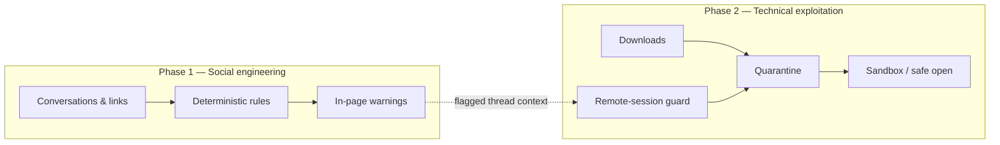
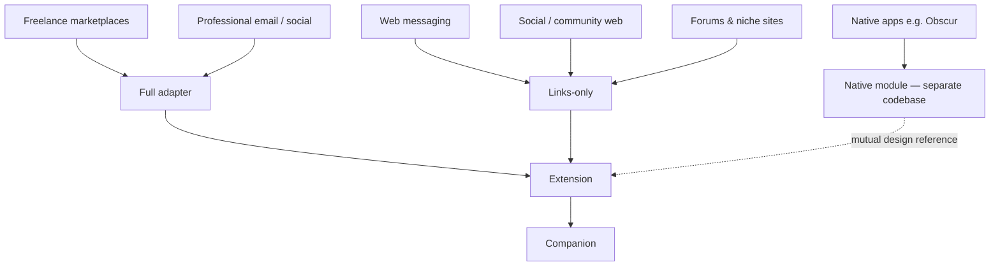

# Product vision

**Status:** Active  
**Last updated:** 2026-06-21  
**Related:** [THREAT_MODEL.md](THREAT_MODEL.md) · [PRODUCT_ROADMAP.md](PRODUCT_ROADMAP.md) · [ADR-007](decisions/ADR-007-obsucr-sibling-project.md)

---

## Why this project exists

Anti-SE Shield is a **distinct, standalone product** for local-first anti–social-engineering (Anti-SE) on the public web and Windows desktop. It shares a maintainer with **Obscur** (decentralized E2EE messenger)—another **separate initiative**—but the two repositories are **not dependencies** of each other. They **mutually reference** design insights: Obscur will continue developing its **own native** Anti-SE module; Shield iterates here on rules, UX, and containment without waiting on or blocking Obscur releases.

**Primary wedge:** **freelance platforms**. Maintainer experience on Upwork-class marketplaces: roughly **eight in ten** new contacts exhibit scam or phishing patterns—fake jobs, off-platform pressure, remote-access requests, test-task malware. That density makes freelance the first place to prove value; other social surfaces follow via adapter tiers (see below).

This repo exists to:

- Ship practical protection where freelancers and independents already work (browser + companion).
- Explore how Anti-SE applies across **online social interaction**—public networks, forums, messaging web clients, and (by reference) private E2EE contexts.
- Document patterns Obscur and other surfaces can learn from, and learn from Obscur’s recipient-local, post-decrypt assessment model in return.

**Product thesis (12–18 months):**

> Help freelancers and independent professionals reject scam *conversations* before they become scam *files* or scam *sessions*—entirely on their own device—then extend the same local-first patterns to other interaction surfaces.

---

## Two pillars (unchanged)

| Pillar | Goal | Primary layer |
|--------|------|----------------|
| **Anti-SE** | Warn before trust breaks down; explain patterns in plain language; preserve user agency | Browser extension (Phase 1) |
| **Anti-malware ingress** | Stop risky downloads and remote-access sessions from compromising the machine | Windows companion (Phase 2) |

Attackers use a **two-phase flow**: social engineering establishes trust and consent; technical payloads follow. Features are mapped explicitly in [THREAT_MODEL.md](THREAT_MODEL.md) (scenarios S1–S7, T1–T6).

---

## What we have today

| Layer | Shipped capability |
|-------|-------------------|
| **Extension** | 12 rules (R01–R12); full adapters for Gmail, LinkedIn, Upwork; link inspector; download intercept; Dev Lab; practice mode; encrypted incident log |
| **Companion** | Quarantine; static file analysis; Windows Sandbox tier; remote-session guard; recovery wizard; localhost dashboard + settings sync |
| **Shared** | `@ase/core` (types, IPC, analysis, export); `@ase/rules`; Dev Lab regression in CI |

**Strong scenario fit:** fake job (S1), test-task malware (S2), remote interview (S6), malicious documents/exes (T1/T2), RAT during flagged threads (T4).

**Partial:** B2B wire fraud (S5), e-commerce phish (S7), messaging web clients (WhatsApp/Telegram links-only).

---

## Where interaction happens (coverage strategy)

Not every surface needs a bespoke DOM adapter. Use **three tiers**:

| Tier | Where | Mechanism |
|------|-------|-----------|
| **Full** | High-value professional surfaces (Gmail, LinkedIn, Upwork, Fiverr, …) | `PlatformAdapter` — thread ID, visible text, overlays |
| **Links-only** | Social web, messaging web, unknown forums | Link inspector + download intercept on user navigation |
| **Download-only** | Any origin | Companion quarantine; extension does not need to read page prose |

### Environment notes

| Environment | Typical threat | This repo today | Direction |
|-------------|----------------|-----------------|-----------|
| Freelance platforms | Off-platform + remote access + test repo | **Best fit** | Generic marketplace adapter (Phase 3) |
| Professional email / LinkedIn | Credential phish, fake portals | **Good** | Job browser profile; login-page UX |
| Web messaging | “Move to Telegram” links | Links-only | Paste-analyze fallback |
| Forums / sketchy sites | Malware attachments, deceptive installs | Download path strong | Links-only + user-triggered analyze; no per-forum DOM |
| Decentralized E2E (Obscur) | Wallet/support impersonation, credential harvest | **Separate product** | Mutual reference for recipient-local UX; Obscur ships its own native module |

**Forums vs insecure sites:** forums need **text analysis** (SE); sketchy sites need **download containment** (malware). Do not conflate them into one adapter type.

---

## What makes this distinctive

Most tools optimize one lane only:

| Alternative | Gap for target users |
|-------------|---------------------|
| Antivirus | Misses the conversation that precedes the file |
| Browser safe browsing | No job/client context; blunt URL blocking |
| Enterprise EDR | Wrong persona, cost, privacy model |
| Awareness training | No in-the-moment friction at click/install time |

**Differentiators to preserve:**

1. **Thread → download → sandbox chain** (one narrative on the dashboard activity feed).
2. **Remote guard during flagged threads** — not merely “remote tool is running.”
3. **Dev Lab** — safe simulation and CI regression without real scammers.
4. **Deterministic, explainable rules** — required for disputes and false-positive feedback.
5. **Local-first invariant** — no default telemetry, no cloud classification of message bodies.

Uniqueness erodes if we become “another URL blocker” or “another sandbox.” Depth on **professional two-phase scams** is the moat.

---

## Personas (freelance first, others follow)

| Persona | Priority | Primary scenarios | Emphasis |
|---------|----------|-------------------|----------|
| **Freelancer** | **Primary** | S1, S2, S6 | Marketplace adapters, remote guard, quarantine — highest scam density in maintainer experience |
| **B2B operator** | Secondary | S5, S3 | Wire/invoice pack, domain similarity, job profile |
| **Marketplace seller** | Secondary | S7, S4 | Payment-flow rules, link inspector |
| **Private-network user** (Obscur) | Separate product | Phish, credential harvest | Obscur’s native dm-kernel module; design ideas exchanged with Shield |

One engine in **this repo** (`@ase/core` + `@ase/rules`); **rule packs** and **adapter tiers** vary by surface. Obscur maintains its own implementation path.

---

## Relationship to Obscur (mutual reference)

**Obscur** and **Anti-SE Shield** are **distinct initiatives** with separate codebases and release trains. Both pursue local-first Anti-SE without intrusive data collection; both are maintained by the same developer, so they **cross-pollinate design** rather than merge into one product.

| | **Anti-SE Shield** | **Obscur** |
|--|-------------------|------------|
| **Product** | Browser extension + Windows companion | Decentralized E2EE messenger |
| **Primary surface** | Public web (freelance-first) | Native/PWA DM after decrypt |
| **Anti-SE module** | `@ase/rules` + extension/companion | Own native SEC-F / dm-kernel (v1.9.5 baseline; future expansion on Obscur timeline) |
| **Relationship** | Reference only — not a dependency | Reference only — not a dependency |

**What Shield can learn from Obscur**

- Recipient-local assessment after content is available on device (no sender notification).
- Relationship context (`contact.cold`) and structural signals vs prose keyword bans.
- Warning UX inside encrypted, decentralized products where centralized moderation does not exist.

**What Obscur can learn from Shield**

- Freelance scam patterns (R01–R12), Dev Lab regression, explainable rule hits.
- Thread → download → containment narrative where OS permits.
- Adapter-tier thinking: full vs links-only vs download-only across web surfaces.

**Optional future alignment** (maintainer choice, not a requirement): shared fixture corpora, aligned rule IDs for overlapping patterns, or published JSON rule schemas. Obscur may implement natively without importing Shield packages.

Obscur reference: [anti-se-shield-mutual-reference.md](file:///E:/Web%20Projects/experimental-workspace/newstart/docs/program/anti-se-shield-mutual-reference.md) · Shield: [ADR-007](decisions/ADR-007-obsucr-sibling-project.md)

---

## Strategic priorities

Aligned with [PRODUCT_ROADMAP.md](PRODUCT_ROADMAP.md):

| Horizon | Focus |
|---------|--------|
| **Now** | Phase 1 ship (store, signed installer, dogfood FP baseline); dashboard as control plane |
| **Next** | Phase 2 unified UX; connection troubleshooting; settings hub (in progress) |
| **Then** | Phase 3 — `PlatformAdapter` in core; generic marketplace + paste-analyze; B2B/marketplace rule packs |
| **Later** | Phase 4 — job profile, local FP/FN metrics; optional cross-repo fixture alignment with Obscur |

---

## Non-goals (protect focus)

| Out of scope | Reason |
|--------------|--------|
| Cloud LLM “is this a scam?” | Conflicts with local-first and explainability |
| Drive-by browser zero-days | OS/browser vendor domain |
| Kernel drivers / network-wide filtering | Different product class |
| Mobile native app injection (generic) | Extension cannot inject; Obscur uses native port |
| Competing with VirusTotal on reputation | Upload model contradicts privacy |
| Centralized moderation or censorship | Incompatible with Obscur; not our role on the open web either—we **warn**, not block globally |

---

## Success signals (local-only)

| Signal | Meaning |
|--------|---------|
| Install → practice proof &lt; 5 min | User sees value without reading docs |
| Dogfood FP rate baseline | Rules improvable without telemetry |
| Dev Lab + CI green | Regressions caught without live scammers |
| Cross-repo design notes maintained | Obscur and Shield stay aligned on principles without code coupling |

---

## Related documents

| Document | Purpose |
|----------|---------|
| [THREAT_MODEL.md](THREAT_MODEL.md) | S1–S7, T1–T6 scenario mapping |
| [PRODUCT_ROADMAP.md](PRODUCT_ROADMAP.md) | Phased delivery schedule |
| [ARCHITECTURE.md](ARCHITECTURE.md) | Monorepo boundaries |
| [ADR-007](decisions/ADR-007-obsucr-sibling-project.md) | Obscur — distinct product, mutual reference |
| [DASHBOARD_UI.md](DASHBOARD_UI.md) | Function-first UI standards |
