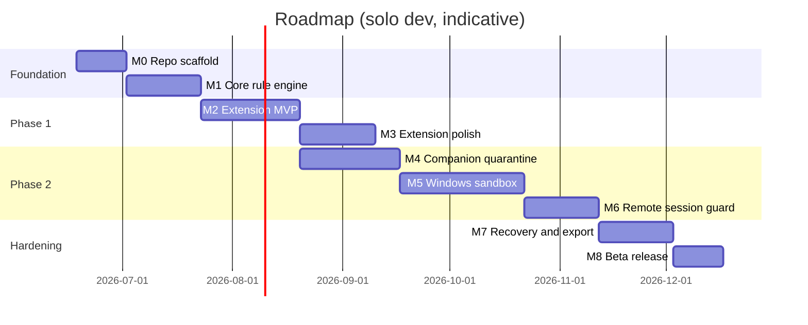

# Product Roadmap

Windows-first, local-first scam protection for online professionals.

**Last updated:** 2026-06-18  
**Horizon:** ~9 months to public beta (solo developer, part-time adjustable)

---

## Vision

One product that protects users **before** they trust a scam (Phase 1) and **after** they download something dangerous (Phase 2)—without sending their data to a cloud surveillance platform.

**North-star sentence for users:**  
*“Check any opportunity, open any file safely, and know what to do if something still goes wrong.”*

---

## Delivery phases overview

Phases M2 and M4 can overlap once the core and IPC contract exist.

---

## Milestone 0 — Repository scaffold (Weeks 1–2)

**Goal:** Runnable monorepo skeleton with CI, no product features yet.

### Deliverables

- [x] pnpm monorepo: `apps/extension`, `apps/companion`, `packages/core`, `packages/rules`, `packages/wasm`
- [x] TypeScript strict mode, shared ESLint/Prettier
- [x] Tauri 2.x companion shell (empty window, system tray placeholder)
- [x] Manifest V3 extension shell (service worker + options page)
- [x] Extension ↔ companion IPC contract (typed messages, documented in `packages/core`)
- [x] GitHub Actions: lint, typecheck, extension build, companion build (Windows)
- [x] `docs/` linked from README

### Acceptance criteria

- `pnpm install && pnpm build` succeeds on Windows
- Extension loads unpacked in Chrome/Edge
- Companion launches and shows “connected / disconnected” to extension
- No network calls in default build

### Out of scope

- Real rules, sandbox, or platform-specific content scripts

---

## Milestone 1 — Core rule engine (Weeks 3–5)

**Goal:** Transparent, local, testable analysis that both apps share.

### Deliverables

- [x] `packages/core`: `AnalysisRequest` / `AnalysisResult` types
- [x] Rule runner: priority, severity, explainability (`id`, `title`, `why`, `whatToDo`)
- [x] Context model: `source` (gmail, linkedin, marketplace, chat, unknown), `threadId`, `senderHints`
- [x] `packages/rules`: initial rule pack (see [THREAT_MODEL.md](THREAT_MODEL.md))
- [x] Unit tests per rule with fixture text/HTML
- [x] Severity aggregation: green / caution / high-risk

### Initial rule set (minimum 12)

| ID | Category |
|----|----------|
| R01 | Off-platform communication pressure |
| R02 | Urgency / artificial deadline |
| R03 | Credential or login link request |
| R04 | Remote access tool mention (AnyDesk, TeamViewer, etc.) |
| R05 | Crypto-only or wire-transfer-only payment |
| R06 | Overpayment / refund difference language |
| R07 | Fake escrow / off-platform payment |
| R08 | “Install our software / run this repo” hiring trap |
| R09 | Domain typo / punycode / brand mismatch |
| R10 | Double file extension |
| R11 | Macro-enabled document hint |
| R12 | OAuth on non-official domain |

### Acceptance criteria

- Given fixture scam messages, engine returns expected severity + matched rules
- Rules are human-readable JSON/TS; no opaque ML required
- 100% offline in tests

---

## Milestone 2 — Extension MVP (Weeks 6–9)

**Goal:** Phase 1 protection on real surfaces freelancers use.

### Deliverables

- [x] Content scripts: **Gmail**, **LinkedIn** (v1 platforms)
- [x] Passive text extraction from visible thread (no background scraping of unrelated mail)
- [x] In-page overlay: traffic-light badge + “Why?” panel (max 3 bullets)
- [x] Link hover inspector: domain age hints (local heuristics), punycode warning
- [x] `chrome.downloads` listener: pause or tag high-risk downloads; notify companion
- [x] Options page: enable/disable rules, allowlist domains, “job browser profile” hint
- [x] Encrypted incident log (IndexedDB + Web Crypto; key derived locally)

### UX requirements (non-technical)

- Default action is visible, not silent
- Every warning includes **what to do next** in plain language
- “Not a scam” dismiss per thread (stored locally)

### Acceptance criteria

- Overlay appears on test threads without breaking page layout
- Download of `brief.pdf.exe` triggers quarantine handoff (companion stub OK)
- No data leaves device in network tab during normal use
- Dogfood: 10 real threads classified with acceptable false-positive rate (document in `docs/feedback/`)

### Out of scope

- Upwork/Fiverr (Milestone 3)
- WASM file analysis in extension

---

## Milestone 3 — Extension polish (Weeks 10–12)

**Goal:** Broaden Phase 1 coverage and retention hooks.

### Deliverables

- [x] Content scripts: **Upwork** or **Fiverr** (pick one based on dogfood)
- [x] WhatsApp Web / Telegram Web: lightweight link + sender context only
- [x] Thread timeline view: escalation pattern (“normal → payment → install”)
- [x] Contact consistency check across messages (local)
- [x] Export incident package (JSON + HTML summary, local files)
- [x] Firefox MV3 build parity

### Acceptance criteria

- Second marketplace integrated with shared rule engine
- User can export one incident without CLI

---

## Milestone 4 — Companion quarantine (Weeks 10–13, overlaps M2)

**Goal:** Phase 2 entry point—nothing runs from Downloads unchecked.

### Deliverables

- [x] Tauri companion: system tray ~~, autostart optional~~ *(autostart not implemented — see Beta ship status)*
- [x] Quarantine store: `~/.../AppData/Local/<AppName>/quarantine/`
- [x] Extension → companion bridge (native messaging or localhost IPC over named pipe)
- [x] Download pipeline: receive metadata (URL, source thread, SHA-256) → copy to quarantine
- [x] Pre-execution static checks (Rust + optional WASM): extension mismatch, zip listing, PDF warnings
- [x] UI: quarantine inbox with **Open safely** | **Not now** | **Delete**

### Acceptance criteria

- [x] File never executes on double-click from quarantine without explicit user choice
- [x] Static analysis runs offline; results shown in plain language
- [x] Companion works when browser is closed (queued downloads processed on launch)

---

## Milestone 5 — Windows sandbox (Weeks 14–18)

**Goal:** Non-technical “Open safely” for job-related files.

See [WINDOWS_SANDBOX.md](WINDOWS_SANDBOX.md) for technical detail.

### Deliverables

- [x] **Tier 1 — Low-rights runner:** AppContainer / restricted token execution for viewers and CLI tools
- [x] **Tier 2 — Windows Sandbox:** one-click disposable VM for `.exe`, installers, MSI
- [x] **Tier 3 — Document lane:** isolated open for PDF Office docs (no macros run on host)
- [x] Network policy: Tier 2 VM networking disabled; Tier 1 host-preview limitation surfaced in UI (PID firewall deferred)
- [x] Session UI: persistent “Safe Workspace” border/watermark
- [x] Post-session summary: “No files were saved to your PC” or explicit export list

### UX requirements

- Single primary button: **Open safely**
- “Open normally anyway” behind Advanced + typed confirm for high-risk
- If Windows Sandbox unavailable (Home SKU, disabled): fall back to Tier 1 + clear message

### Acceptance criteria

- [x] EICAR or benign test payload runs contained without host persistence (test harness documented)
- [x] User completes “open safely” flow in under 3 clicks from quarantine notification
- [x] Fallback path tested on Windows 10 and 11

### Honest limits (shipped in product copy)

- Cannot guarantee protection if user bypasses sandbox
- Admin-install malware outside companion is out of scope for v1

---

## Milestone 6 — Remote session guard (Weeks 19–21)

**Goal:** Contain Phase 2 “pair programming” / support desk takeovers.

### Deliverables

- [x] Process watch: AnyDesk, TeamViewer, RustDesk, Quick Assist, etc.
- [x] Correlation with extension “active job thread” context when available
- [x] Full-screen consent dialog: **End session** | **Continue with shield** | **I started this**
- [x] Sensitive app shield (best-effort): foreground warnings when password manager / banking detected during remote session
- [x] Incident log entry auto-created

### Acceptance criteria

- [x] Launching remote tool during flagged thread shows prompt within 5 seconds
- [x] User can end session from companion without hunting the tray icon

---

## Milestone 7 — Recovery kit (Weeks 22–24)

**Goal:** Retention and trust after a near-miss or incident.

### Deliverables

- [x] Guided wizard: rotate passwords, revoke OAuth, check payout details
- [x] Local “exposure check” checklist (browser extensions, startup entries snapshot)
- [x] One-click **undo suspicious changes** (startup / scheduled tasks diff—user-approved)
- [x] Printable / exportable report for platform support

### Acceptance criteria

- [x] Non-technical tester completes wizard without documentation
- [x] Export opens in standard PDF viewer

---

## Milestone 8 — Public beta (Weeks 25–26)

**Goal:** Ship to early freelancers and B2B users.

### Deliverables

- [x] Chrome Web Store + Edge Add-ons listing (privacy policy: no data collection)
- [x] Signed Windows companion installer (Tauri bundler)
- [x] Onboarding tutorial + practice mode (safe fake scam thread)
- [x] `docs/feedback/` template for false positive/negative reports (local export, user-initiated)

### Acceptance criteria

- [x] Clean install on fresh Windows 11 VM *(procedure in [BETA.md](BETA.md); formal VM sign-off pending)*
- [x] Store review privacy questionnaire completed *(answer template in [store/](store/); not submitted to stores)*
- [x] Known issues documented

### Beta ship status (honest, 2026-06-18)

| Item | Code / docs | Shipped to users |
|------|-------------|------------------|
| Extension build + sideload | Done | Yes (developer mode) |
| Chrome Web Store / Edge listing | Checklists in `docs/store/` | **Not live** — submit pending |
| NSIS installer (`tauri:build`) | CI + bundler | Yes (unsigned) |
| Authenticode signing | Documented in BETA.md | **Not done** |
| Dogfood / FP rate metrics | — | **Not measured** |
| Web dashboard | `apps/dashboard` @ :47123 | Done (post-M8) |
| Dev Lab (simulated fraud scenarios) | `docs/DEV_LAB.md`, extension page | Done (post-M8) |

### Known gaps in earlier milestones (not blocking sideload beta)

- [ ] M4 companion **autostart** (optional) — tray only today
- [ ] M2 **domain age** hints — offline heuristics only; age not available without network
- [ ] M5 Tier 1 **AppContainer** — preview/listing lane shipped; full AppContainer deferred ([ADR-001](decisions/ADR-001-sandbox-tier-implementation.md))
- [ ] M5 **firewall** outbound block for Tier 1 — deferred ([WINDOWS_SANDBOX.md](WINDOWS_SANDBOX.md))
- [ ] M3 **Fiverr** content script — Upwork chosen; Fiverr rules only

---

## Post-beta backlog (prioritized, not scheduled)

**Scheduled phases:** see [PRODUCT_ROADMAP.md](PRODUCT_ROADMAP.md) (Phase 1–4). Phase 1 execution: [phases/PHASE_1_SHIP.md](phases/PHASE_1_SHIP.md).

| Priority | Feature | Notes |
|----------|---------|-------|
| P1 | macOS companion | Reuse core; different sandbox backend |
| P1 | Upwork + Fiverr + remaining marketplace | Content script maintenance |
| P2 | WASM deep inspection in companion | Archives, embedded URLs |
| P2 | Job browser profile enforcement | Separate Chromium profile |
| P3 | Linux companion | bubblewrap/Firejail lane |
| P3 | Signed rule pack updates | HTTPS + content hash; still no user telemetry |
| P4 | Optional community hash sharing | Opt-in, anonymized, clearly separated module |

---

## Success metrics

| Metric | Target (beta) |
|--------|----------------|
| Phase 1 warnings per active user / week | Meaningful engagement, not noise |
| “Open safely” usage vs normal open | >50% for high-risk quarantine items |
| User-reported prevented loss | Qualitative case studies ≥5 |
| False positive rate (Phase 1) | <15% on dogfood set; trending down |
| Uninstall survey (optional, local) | Top reason documented |

---

## Risks and mitigations

| Risk | Mitigation |
|------|------------|
| Platform DOM changes break content scripts | Fixture-based smoke tests; graceful degradation |
| Windows Sandbox not on all SKUs | Tier 1 fallback + honest UX |
| False positives erode trust | Explainable rules; easy dismiss; local allowlist |
| Store rejection (broad permissions) | Minimal host permissions; justification in review notes |
| Scope creep into full antivirus | Stay containment + guidance; partner AV later if needed |
| Solo maintainer bandwidth | Milestone gates; one marketplace at a time |

---

## Definition of done (global)

A milestone is done when:

1. Acceptance criteria met on Windows 10/11
2. Types and tests pass in CI
3. User-facing strings reviewed for plain language
4. `ROADMAP.md` checklist updated
5. No regressions to local-first / no-telemetry defaults
