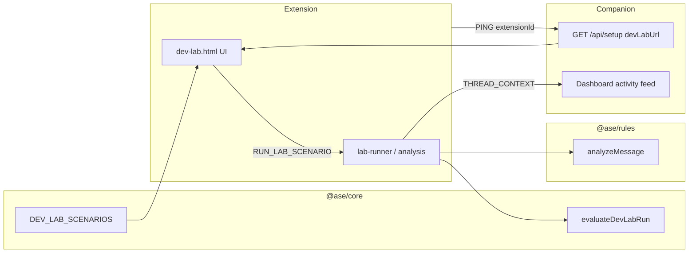

# ADR-006: Dev Lab — simulated fraud environment

**Status:** Accepted  
**Date:** 2026-06-18  
**Context:** Post-M8 — testers and early users need to validate rule behavior without hunting real scammers, phishing pages, or malware interfaces.

---

## Decision

Implement a **Dev Lab** as an extension-hosted simulation harness that reuses the production analysis pipeline on curated, local-only fixtures.

1. **Scenario source of truth** — `packages/core/src/dev-lab.ts` defines scenarios, link fixtures, thread ID conventions, and evaluation helpers (`evaluateDevLabRun`, `buildDevLabAnalyzePayload`).
2. **Extension UI** — `apps/extension/src/dev-lab/` renders platform chrome (Gmail, LinkedIn, Upwork) and drives analysis via service-worker messages (`RUN_LAB_SCENARIO`, `RUN_ALL_LAB_SCENARIOS`).
3. **Same engine path** — `lab-runner.ts` calls `runThreadAnalysis` with `{ labMode: true }`, which skips live-site overlay checks but otherwise uses `@ase/rules` unchanged.
4. **Incident isolation** — thread IDs use prefix `ase-dev-lab-*` (practice reuses `ase-practice-mode`). `isDevLabThreadId()` prevents these from appending to the user incident log.
5. **Companion mirror** — lab runs record `lab_scenario` activity on the dashboard feed when the companion is running.
6. **Regression tests** — `packages/rules/src/dev-lab.test.ts` runs every scenario through `analyzeMessage` in CI.
7. **Dashboard link** — extension sends `chrome.runtime.id` on `PING`; companion exposes `devLabUrl` on `GET /api/setup` so the web dashboard can link directly to `chrome-extension://{id}/src/dev-lab/dev-lab.html`.

---

## Architecture

---

## Scenario contract

Each `DevLabScenario` includes:

| Field | Purpose |
|-------|---------|
| `messages` | UI transcript for the fake thread |
| `analysis` | Payload passed to the rule engine |
| `expectedLevel` | `safe` / `caution` / `high-risk` |
| `expectedRuleIds` | Subset of rules that must fire |
| `teachingPoint` | Human-readable takeaway for demos |

`evaluateDevLabRun` requires level match and that every expected rule ID appears in hits (extra hits are allowed).

---

## Dev Lab vs Practice mode

| | Practice | Dev Lab |
|---|----------|---------|
| Audience | End users, onboarding | Developers, demos, regression |
| Scenarios | 1 (shared fixture) | 8 + link fixtures |
| UI | Single thread page | Platform chrome + suite runner |
| Data | Never logged as incident | Never logged as incident |

Practice scenario `practice-hiring-scam` is the first Dev Lab scenario; `onboarding.ts` imports it so both stay in sync.

---

## Security and privacy

- No network calls; all text and URLs are static fixtures.
- Lab threads never pollute the incident export or recovery snapshot.
- `labMode` is only set from extension-internal pages and the service worker — not from content scripts on live sites.

---

## Consequences

- Scenario text must be tuned to match rule phrase lists; regression tests catch drift.
- `chrome-extension://` links in the dashboard only work after the extension has pinged the companion at least once.
- Unpacked vs store extension IDs differ per install; the URL is derived at runtime, not hard-coded.

---

## Alternatives considered

- **Hosted fake scam sites** — rejected; requires maintenance, HTTPS, and risks being indexed or abused.
- **Companion-only simulation** — rejected; would not exercise extension analysis, timeline, or badge UI.
- **Record lab runs as real incidents** — rejected; would confuse users and recovery exports.
