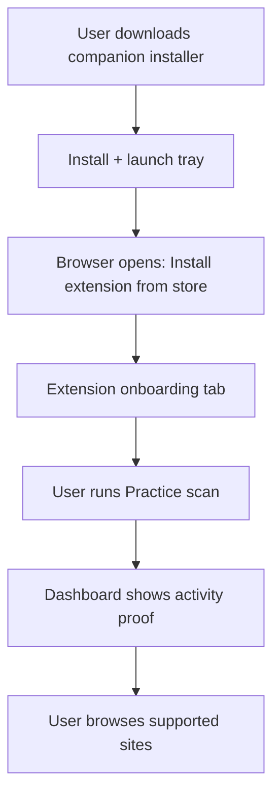

# Phase 1 — Ship-ready

**Goal:** Extension and companion installable by non-developers.  
**Parent:** [PRODUCT_ROADMAP.md](../PRODUCT_ROADMAP.md)  
**Target version:** `1.0.0` (or `1.0.0-beta.2` if store requires iterative review)

---

## Status dashboard

Update checkboxes as work completes.

### Distribution

- [ ] Privacy policy hosted at stable HTTPS URL — **https://dendro-x0.github.io/ase-shield/privacy.html** (auto-deployed by CI on push to `main`)
- [x] Extension zip built (`pnpm package:extension`)
- [ ] Chrome Web Store submitted
- [ ] Chrome Web Store approved / live
- [ ] Edge Add-ons submitted
- [ ] Edge Add-ons approved / live
- [ ] Authenticode certificate obtained
- [ ] Signed NSIS installer built and verified
- [ ] Release artifacts uploaded (GitHub Releases or download page)

### First-run experience

- [x] Companion installer opens dashboard or setup tab after install
- [x] Onboarding mentions store extension install (not sideload)
- [x] Extension `onInstalled` opens onboarding on store install
- [x] Practice scan → dashboard proof documented in onboarding
- [x] Connection troubleshooting copy in dashboard + popup

### Quality gate

- [ ] Fresh Windows 11 VM sign-off (checklist below)
- [ ] Dogfood tracker started ([dogfood/TRACKER.md](../dogfood/TRACKER.md))
- [ ] KNOWN_ISSUES.md updated for store/live install path
- [ ] BETA.md updated with consumer install instructions

---

## Week-by-week guide (part-time)

| Week | Focus | Tasks |
|------|-------|-------|
| **1** | Assets & privacy | Host privacy URL; capture screenshots; run `package:extension` |
| **2** | Store submit | Chrome + Edge listings; review notes for permissions |
| **3** | Signing | Obtain cert; configure signing; signed CI or local build |
| **4** | First-run UX | Companion post-install tab; onboarding store links |
| **5** | Dogfood | 10+ threads; log FP/FN; fix blockers |
| **6** | VM sign-off | Full acceptance on clean VM; tag release |

---

## 1. Privacy policy hosting

Stores require a **public HTTPS URL** (not a GitHub blob alone in some cases).

See [store/PRIVACY_HOSTING.md](../store/PRIVACY_HOSTING.md).

**Before submit:** open the URL in an incognito window and confirm it matches [PRIVACY.md](../PRIVACY.md).

---

## 2. Extension packaging

```bash
pnpm install
pnpm build
pnpm package:extension
```

**Output:** `dist/release/anti-se-shield-extension-1.0.0-beta.1.zip`

Upload this zip to Chrome Web Store Developer Dashboard and Edge Partner Center.

**Pre-upload checklist:**

- [ ] `manifest.json` version matches release tag
- [ ] No dev-only permissions or localhost-only test flags
- [ ] Icons 128×128 present in zip root
- [ ] Load unpacked from fresh zip once to smoke-test

---

## 3. Store submission

| Store | Guide | Developer portal |
|-------|-------|------------------|
| Chrome | [CHROME_WEB_STORE.md](../store/CHROME_WEB_STORE.md) | [Chrome Web Store Developer Dashboard](https://chrome.google.com/webstore/devconsole) |
| Edge | [EDGE_ADDONS.md](../store/EDGE_ADDONS.md) | [Microsoft Partner Center](https://partner.microsoft.com/dashboard/microsoftedge/overview) |

**Review notes to include:**

- Localhost permission is for optional Windows companion only (`127.0.0.1:47123`).
- `downloads` queues files for local quarantine when companion is installed.
- `management` used only when user starts recovery wizard.
- No remote servers receive user content.

**Screenshots to capture (no real PII):**

1. Onboarding welcome step
2. Practice mode high-risk result
3. LinkedIn/Gmail overlay (Dev Lab or practice)
4. Extension popup — Connected
5. Dashboard overview with setup checklist
6. Settings — rule toggles

---

## 4. Authenticode signing (companion)

### Prerequisites

- Windows Authenticode code signing certificate (EV recommended for immediate SmartScreen trust)
- Certificate in `.pfx` file or Windows certificate store

### Environment variables (CI or local)

| Variable | Purpose |
|----------|---------|
| `WINDOWS_CERTIFICATE` | Base64-encoded `.pfx` **or** path to file |
| `WINDOWS_CERTIFICATE_PASSWORD` | PFX password |
| `TAURI_SIGNING_PRIVATE_KEY` | Optional Tauri updater signing |

### Local signing (example)

Use `signtool.exe` after NSIS build:

```powershell
signtool sign /fd SHA256 /f "path\to\cert.pfx" /p "%WINDOWS_CERTIFICATE_PASSWORD%" `
  "apps\companion\src-tauri\target\release\bundle\nsis\Anti-SE Companion_*.exe"
```

Verify:

```powershell
signtool verify /pa "path\to\installer.exe"
```

### Tauri bundle config (when cert is ready)

Add to `apps/companion/src-tauri/tauri.conf.json` under `bundle.windows`:

```json
"certificateThumbprint": "YOUR_CERT_THUMBPRINT",
"digestAlgorithm": "sha256",
"timestampUrl": "http://timestamp.digicert.com"
```

Or use `signCommand` for custom signtool invocation — see [Tauri Windows code signing](https://v2.tauri.app/distribute/sign/windows/).

**Until signed:** document SmartScreen steps in installer README; do not publish unsigned installer to general public without beta disclaimer.

---

## 5. Post-install funnel (target flow)



### Implementation tasks (Phase 1 code)

| Task | Location | Status |
|------|----------|--------|
| NSIS finish hook opens dashboard | `launch.rs` first-run + `/?welcome=1` | [x] |
| Store extension URL in companion config | `packages/core/src/ship.ts` | [x] |
| Onboarding step: install companion link | `onboarding.ts` + `ship.ts` | [x] |
| Onboarding step: open dashboard | `onboarding.ts` + `ship.ts` | [x] |
| Popup shows setup checklist until practice done | `popup.ts` | [x] |
| Troubleshooting banner when disconnected | `popup.ts`, `OverviewPage.tsx` | [x] |

**Store extension URL placeholder:** update when listing is live:

```
https://chrome.google.com/webstore/detail/anti-se-shield/EXTENSION_ID
```

---

## 6. Dogfood program

Use [dogfood/TRACKER.md](../dogfood/TRACKER.md).

**Minimum before `1.0.0` tag:**

- 10 real or realistic threads across Gmail, LinkedIn, Upwork
- 3 benign control threads (no false high-risk)
- 2 practice + 2 Dev Lab regression runs recorded
- Any FP/FN filed via Settings → Beta feedback

**FP target for Phase 1:** establish baseline; aim &lt;15% false high-risk on dogfood set before broad marketing.

---

## 7. Fresh Windows 11 VM acceptance

Run on a VM **without** dev tools or repo checkout.

### Install

1. Download signed companion installer from release page
2. Install; confirm tray icon appears
3. Install extension from Chrome Web Store (or Edge)
4. Complete onboarding tab

### Verify Phase 1

| Step | Expected |
|------|----------|
| Popup → status | **Connected** within 10s of companion running |
| Open `http://127.0.0.1:47123/` | Dashboard loads |
| Popup → Practice → Analyze | **high-risk** |
| Dashboard → Overview | Practice row in Recent activity |
| Popup → Dev Lab → Run one scenario | PASS for hiring scam |
| Download test file on flagged thread | Quarantine item in dashboard |

### Sign-off

| Field | Value |
|-------|-------|
| Tester | |
| Date | |
| OS build | |
| Extension version | |
| Companion version | |
| Pass / Fail | |
| Notes | |

---

## 8. Release process

### Manual release (maintainer)

```bash
# 1. Bump versions (extension manifest, companion tauri.conf, package.json)
# 2. Full build
pnpm build && pnpm test

# 3. Package extension
pnpm package:extension

# 4. Build signed companion (with cert env vars set)
pnpm --filter @ase/companion tauri:build

# 5. Tag
git tag v1.0.0
git push origin v1.0.0
```

### CI release workflow

Push tag `v*` to trigger [.github/workflows/release.yml](../../.github/workflows/release.yml) (packages extension zip; companion build when signing secrets configured).

---

## 9. Phase 1 → Phase 2 handoff

Do **not** start Phase 2 until:

- [ ] At least one store listing is **live**
- [ ] Signed installer available to testers
- [ ] VM sign-off **Pass**
- [ ] Dogfood tracker has ≥10 entries

**Next:** [PRODUCT_ROADMAP.md](../PRODUCT_ROADMAP.md) Phase 2 — Unified UX foundation.
